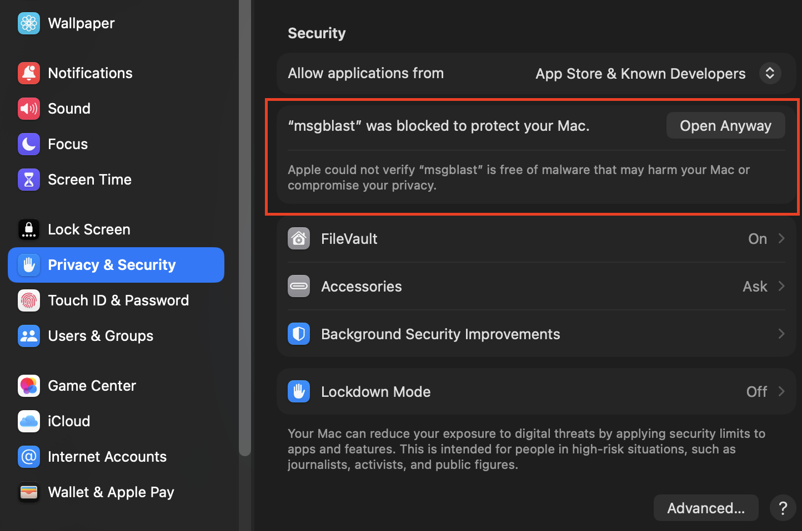
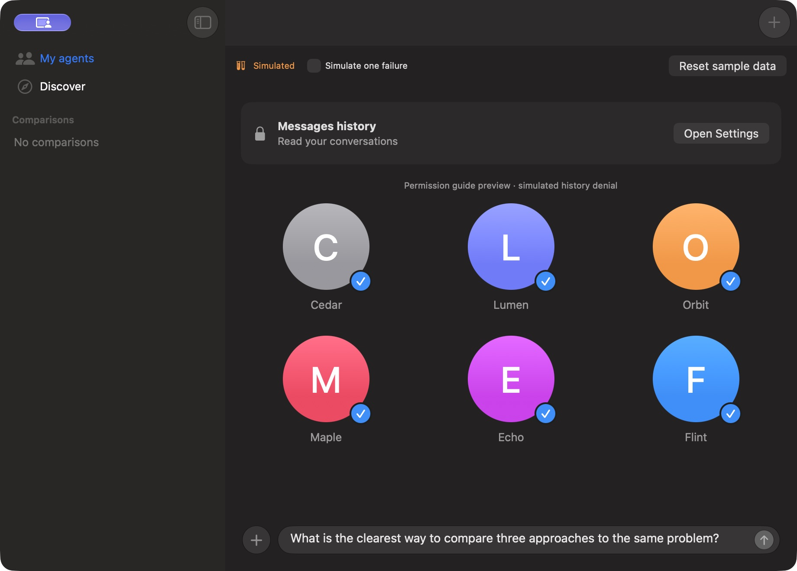
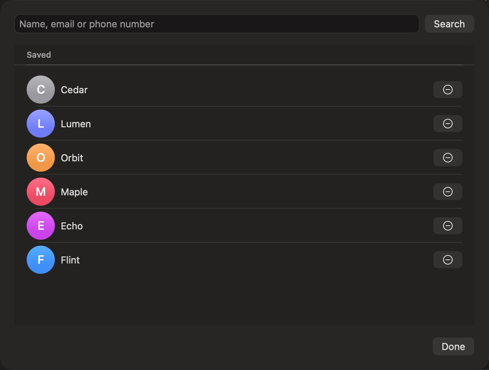

# msgblast

msgblast is a Mac app for comparing AI agents through Messages. Send the same prompt to selected agents and read their replies side by side. Attach photos or files, send follow-ups, and reopen saved comparisons.

Requires **macOS 26 or later** and existing one-to-one iMessage conversations with the agents you want to message.

## Download and install

[Download msgblast for Mac](https://updates.msgblast.app/latest.zip)

Unzip the download, drag **msgblast.app** into **Applications**, and open it.

### If macOS blocks the first launch

After trying to open msgblast, open **System Settings → Privacy & Security**, scroll to the security section, and select **Open Anyway**. Confirm **Open** when macOS asks again, if you trust the download. [Apple's first-launch instructions](https://support.apple.com/en-us/102445#openanyway).



## Get started

### 1. Allow access to Messages history

Click **Open Settings** in msgblast's Messages history banner.



In **System Settings → Privacy & Security → Full Disk Access**, click **+**, choose **msgblast.app** from **Applications**, and click **Open**. Enable its switch and authenticate if requested. You can also drag the app card into that list. [Apple's Full Disk Access instructions](https://support.apple.com/guide/mac-help/change-privacy-security-settings-on-mac-mchl211c911f/mac).

Quit and reopen msgblast, then click **Check again** if the history banner remains.


### 2. Allow Contacts and Messages Automation

Allow Contacts when msgblast asks, so it can find and save agent contacts. If you previously declined, open **System Settings → Privacy & Security → Contacts** and enable access for msgblast. [Apple's privacy settings guide](https://support.apple.com/guide/mac-help/change-privacy-security-settings-on-mac-mchl211c911f/mac).

On your first send, allow msgblast to control **Messages**. If you previously declined, open **System Settings → Privacy & Security → Automation**, expand msgblast, and enable **Messages**. [Apple's Automation instructions](https://support.apple.com/en-nz/guide/mac-help/mchl108e1718/mac).

### 3. Add agents and send a prompt

Find agents in **Discover**, or click **+** to search by name, email or phone number. Start a one-to-one conversation with the agent in Messages first if it does not have one yet.



Select your agents, write a prompt, and press the send arrow. Their replies appear together for comparison.

*These are actual app screenshots captured with demo contacts and a simulated history-access prompt.*

Check for new versions from **msgblast → Check for Updates**.

## Comparison reports

Click **Summarize** in a comparison to open a report with a recommended next action, a comparison of the replies, and open questions. Reports use an installed personal-agent CLI and its existing account. See [personal agent reports](docs/personal-agent-reports.md) for setup, supported CLIs, privacy limits, and fixture validation.

## Build it yourself

Install **Xcode 27**, then clone this repository and build the app:

```sh
git clone https://github.com/mgalpert/msgblast.git
cd msgblast
xcodebuild -project msgblast.xcodeproj -scheme msgblast \
  -derivedDataPath build/from-source -destination 'platform=macOS' build
open build/from-source/Build/Products/Debug/msgblast.app
```

You can also open **msgblast.xcodeproj** in Xcode, select the **msgblast** scheme, and click **Run**.

## Embedded web agents

Select **Muse, ChatGPT, Claude, or Grok** beside your Messages agents in **My agents**. All four web agents start selected; their checkmarks control who receives the prompt, and your changes are saved. Press **Send & compare** with your request. If a selected agent needs setup, msgblast opens the embedded pages and shows a first-use overlay explaining how to sign in. Your request stays in the shared composer; after signing in, press **Send & compare** again. Login does not submit automatically. Right-click **Open chat** is also available, and after a sent message **My agents** shows **Open** buttons for returning to the chats. Claude's `claude.com` site currently redirects to `claude.ai`; the agent opens `https://claude.ai/new`. Grok is the `grok.com` service, separate from the Grok Bot desktop app.

Each selected service creates a **dedicated chat for each new comparison** (a side chat in Muse), then keeps follow-ups in that same chat. Reopen a comparison from the sidebar to return to the saved conversations for Muse, ChatGPT, Claude, and Grok; choose **New comparison** for separate conversations. The app saves each service’s conversation URL, while the website retains its history. If a service does not assign a saved-chat URL, the send stays unconfirmed and the app does not automatically retry or create another chat.

Each agent has a separate persistent WebKit data store. Sign in inside msgblast once; Safari, Chrome, and desktop-app logins are separate and their cookies are not imported. The existing Muse file, session identifier, selection, and pending sends migrate in place. New providers start selected. HTTPS sign-in popups stay in an app sheet with their URL visible.

Before a shared submission, msgblast checks that all selected web conversations can open. A missing login keeps the request in the composer without sending to any recipient. Once ready, the shared composer submits text concurrently to selected web agents and independently to selected Messages agents. Each web pane displays its own submission result and the service's actual conversation, replies, links, and approval controls. Selecting an agent does not start a new conversation on every send. The home control returns to the comparison’s saved conversation, or its new-chat page before the first send. Conversation URLs are saved with the comparison; transcripts remain on each service.

Web sends require an empty site composer, recognizable signed-in UI, and unambiguous controls. Existing drafts are preserved. Intent is saved before clicking Send once, then the app checks for a new outgoing message with matching text. **Appeared in [agent]** is a page observation, not a server delivery acknowledgement. Interrupted or unconfirmed sends are not retried automatically. Native Messages retains its existing attachments and retry workflow; shared sends including web agents are text-only.

Muse still uses the signed-in user's displayed avatar when readable, with the bundled website image as fallback. It stays in memory and clears on sign-out or navigation. ChatGPT and Claude use their iOS app icons; Grok uses the generated artwork bundled with the app.

### Verification status

**Dedicated chats in Muse, ChatGPT, Claude, and Grok are preview integrations pending authenticated live validation.** Current English DOM selectors include compatibility assumptions beyond the signed-out ChatGPT/Grok controls inspected on October 5, 2026. An unrecognized layout disables shared sending and leaves the embedded page available. Fixtures do not prove a site's authentication, anti-automation behavior, long-running background operation, or future compatibility. No website integration can promise that every future site version will work unchanged.

Run `zsh scripts/build_web_preview.sh` and open `build/msgblast Web Preview.app` for live sign-in checks. It has a separate bundle identifier, blue demo icon, and `~/Library/Application Support/MsgBlast-WebPreview` state. **All web services are live; Messages are synthetic.** This does not install over the development app.

Run `zsh scripts/build_web_preview.sh --fixture` and open `build/msgblast Muse Fixture.app` for an entirely local test of all four web agents. The historical fixture app name is retained. Every launch uses temporary state and no destination sends externally. [Multi-agent verification and evidence](docs/evidence/multi-web-agents/validation.md) distinguishes fixture results from live checks.

Core tests exercise the real WebKit engine for concurrent sends, replies, textarea/contenteditable inputs, first-message URL transitions, repeated identical prompts, existing drafts, expired sessions, ambiguous controls, storage failures, session isolation, Muse migration, and avatar lifecycle. Direct native UI checks cover agent selection and the shared composer. Run the isolated core suite without launching the user's development app:

```sh
xcodebuild -project msgblast.xcodeproj -scheme msgblast \
  -derivedDataPath build/webkit-validation -destination 'platform=macOS,arch=arm64' \
  'PRODUCT_BUNDLE_IDENTIFIER=com.msgblast.webkit-validation.$(PRODUCT_NAME:rfc1034identifier)' \
  -only-testing:msgblastTests test
```

After building, `bash scripts/test_web_comparisons.sh build/webkit-validation` checks production comparison reopening, native attachment follow-ups, retry isolation, and quit/update deferral with controlled local fixtures. [Saved-chat validation](docs/evidence/dedicated-web-chats/validation.md) records the current results and live-test boundary.

## License

Copyright (C) 2026 Michael Galpert and contributors.

Except where separately licensed or attributed, msgblast is licensed under the
[GNU General Public License, version 3 only](LICENSE) (`GPL-3.0-only`). You may
use, modify, and redistribute it, including commercially, under those terms.
Distributed modified versions must remain under GPLv3 and include the
corresponding source as required by the license. The software comes without
any warranty.

Third-party dependencies, service icons, logos, and other attributed assets
retain their respective licenses and rights; this license does not relicense
third-party material or grant trademark rights.
