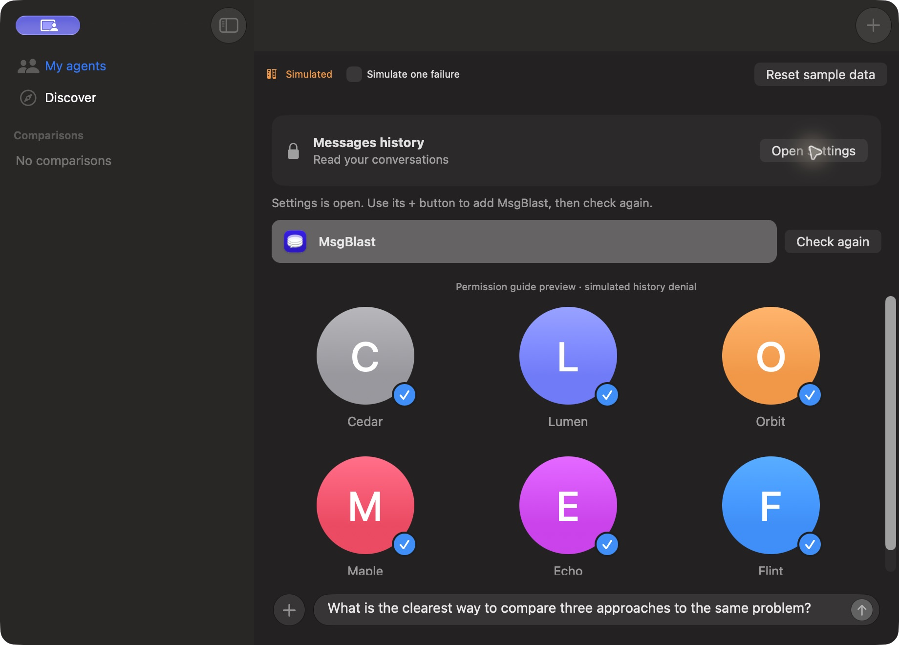

# MsgBlast

MsgBlast is a Mac app for comparing AI agents through Messages. Send the same prompt to selected agents and read their replies side by side. Attach photos or files, send follow-ups, and reopen saved comparisons.

Requires **macOS 26 or later** and existing one-to-one iMessage conversations with the agents you want to message.

## Download

[Download MsgBlast for Mac — version 0.1.0](https://updates.msgblast.app/downloads/MsgBlast-0.1.0-1.zip)

Unzip the download, drag **MsgBlast.app** into **Applications**, and open it.

### If macOS blocks the first launch

After trying to open MsgBlast, open **System Settings → Privacy & Security**, scroll to the security section, and select **Open Anyway**. Confirm **Open** when macOS asks again, if you trust the download. [Apple's first-launch instructions](https://support.apple.com/en-us/102445#openanyway).


*Apple's illustration uses “Example App”; look for MsgBlast on your Mac. The appearance may vary by macOS version.*

## Get started

### 1. Allow access to Messages history

Click **Open Settings** in MsgBlast's Messages history banner.


In **System Settings → Privacy & Security → Full Disk Access**, click **+**, choose **MsgBlast.app** from **Applications**, and click **Open**. Enable its switch and authenticate if requested. You can also drag the app card into that list. [Apple's Full Disk Access instructions](https://support.apple.com/guide/mac-help/change-privacy-security-settings-on-mac-mchl211c911f/mac).

Quit and reopen MsgBlast, then click **Check again** if the history banner remains.



### 2. Allow Contacts and Messages Automation

Allow Contacts when MsgBlast asks, so it can find and save agent contacts. If you previously declined, open **System Settings → Privacy & Security → Contacts** and enable access for MsgBlast. [Apple's privacy settings guide](https://support.apple.com/guide/mac-help/change-privacy-security-settings-on-mac-mchl211c911f/mac).

On your first send, allow MsgBlast to control **Messages**. If you previously declined, open **System Settings → Privacy & Security → Automation**, expand MsgBlast, and enable **Messages**. [Apple's Automation instructions](https://support.apple.com/en-nz/guide/mac-help/mchl108e1718/mac).

### 3. Add agents and send a prompt

Find agents in **Discover**, or click **+** to search by name, email or phone number. Start a one-to-one conversation with the agent in Messages first if it does not have one yet.


Select your agents, write a prompt, and press the send arrow. Their replies appear together for comparison.

*These are actual app screenshots captured with demo contacts and a simulated history-access prompt.*

Check for new versions from **MsgBlast → Check for Updates**.

## Build it yourself

Install **Xcode 27**, then clone this repository and build the app:

```sh
git clone https://github.com/mgalpert/msgblast.git
cd msgblast
xcodebuild -project MsgBlast.xcodeproj -scheme MsgBlast \
  -derivedDataPath build/from-source -destination 'platform=macOS' build
open build/from-source/Build/Products/Debug/MsgBlast.app
```

You can also open **MsgBlast.xcodeproj** in Xcode, select the **MsgBlast** scheme, and click **Run**.
