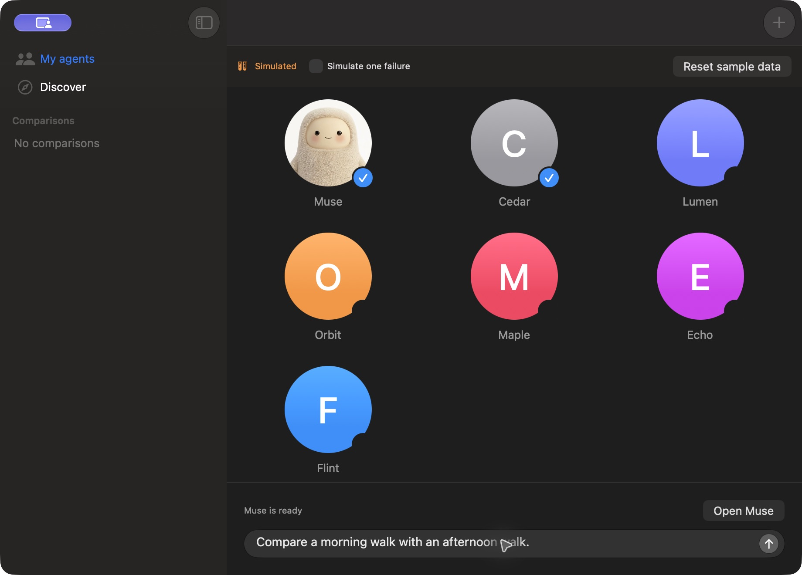
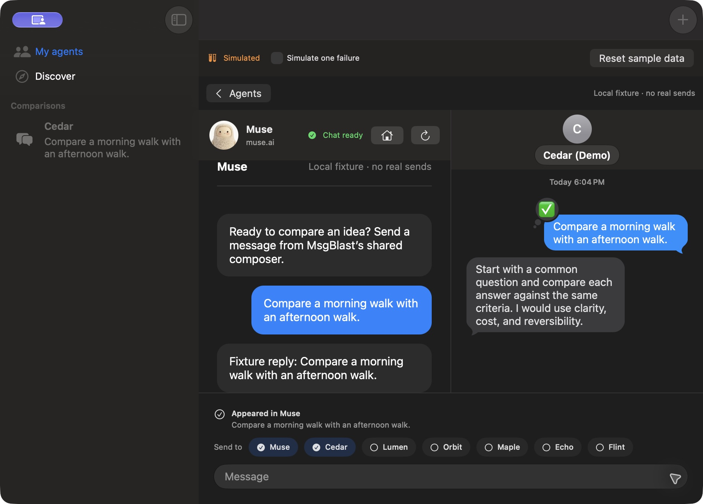

# Default Muse avatar

The default agent image is the unchanged [Muse website avatar](https://muse.ai/images/landing/brand/hatch.jpg), bundled locally. The normal `AgentAvatar` view crops it to a circle in My agents, the embedded chat header, and the connection screen. No remote image request or logged-in session is needed to display it.

## Validation

- Built both the isolated Muse fixture and the live web preview successfully.
- Compared the source JPEG with the fixture app's packaged resource: identical bytes.
- Opened the rebuilt fixture and visually verified the avatar in the agent grid and chat header.
- Selected Muse and Cedar, sent one shared synthetic prompt, and observed both synthetic replies.
- Reviewed the small source/project-resource diff and ran `git diff --check` successfully. Messaging and session logic did not change; the prior 52-test core result was not rerun for this image-only follow-up.

## Screenshots

Actual native macOS screenshots from the avatar revision, with synthetic local Muse and Messages transports. No live messages were sent. Mobile evidence is not applicable.

## Video

[Avatar workflow MP4](avatar-walkthrough.mp4)

This is a sampled walkthrough made from four actual captures with edited timing, not a continuous recording or a measurement of live provider latency. It shows the initial avatar, selection, submission, and replies. It supersedes the prior walkthrough for the avatar's appearance. The earlier mixed-failure/retry evidence remains documented in [the original integration validation](../muse-webkit/validation.md).
