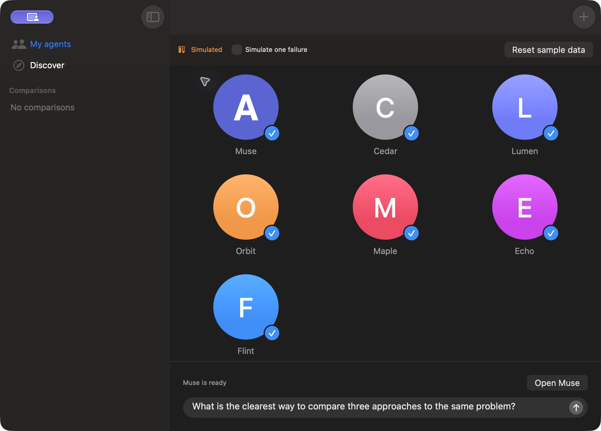
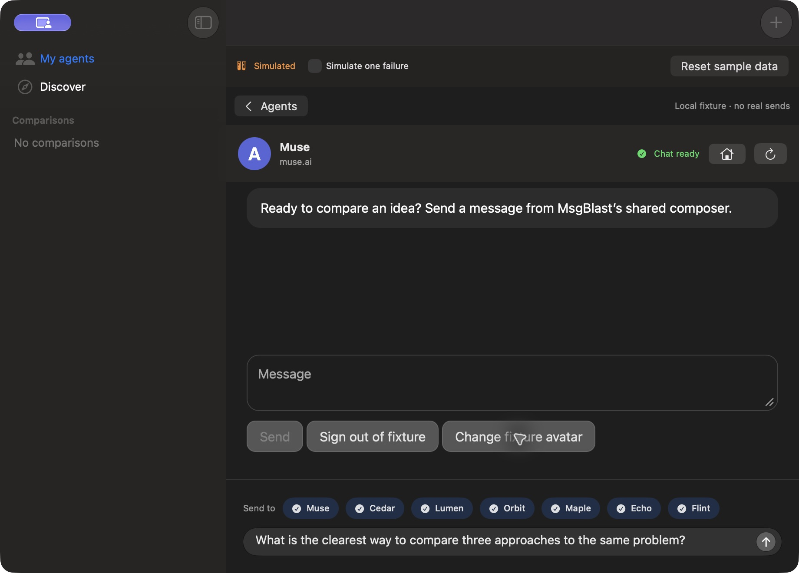
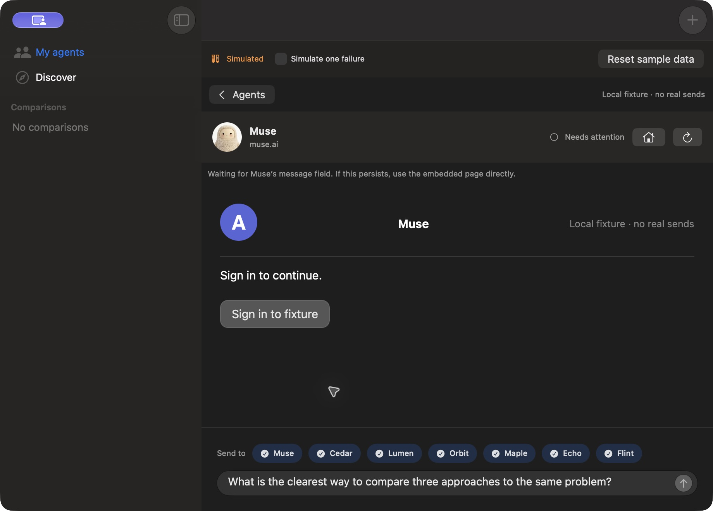

# Signed-in Muse avatars

MsgBlast prefers the avatar displayed by the signed-in main Muse chat. The adapter uses the main chat's `data-hatch-avatar-host` / `chat-nav` markers and its current ready image or video layer, observed in Muse's shipped frontend. It ignores ordinary chat images and ambiguous or hidden hosts. A video supplies one still per media source, not continuous animation.

The adapter reads already-loaded media pixels in WKWebView. It does not inspect credentials, copy Safari cookies, call a private API, or fetch an avatar URL through a separate network client. Native code accepts only a bounded 256×256 PNG. An unchanged source retains the same still; changing the media replaces it. The avatar is memory-only and clears on navigation, sign-out/not-ready state, or unreadable media. A saved selected Muse session reconnects when the agent view opens.

The website image remains the fallback before connection and when no unambiguous avatar can be read. Cross-origin media without canvas permission also falls back; this change does not claim that every future Muse frontend or media format works.

## Validation

- **55 core tests passed, zero failures/skips**: `Test-MsgBlast-2026.10.02_18-13-55--0700.xcresult`.
- Added real WKWebView regressions for avatar replacement, unchanged-source caching, sign-out/relogin/reload clearing, and rejecting ordinary images, hidden hosts, or multiple hosts.
- Both isolated fixture and live preview builds passed.
- Direct native operation verified a synthetic personalized avatar in the header and My agents, then restoration of the default after fixture sign-out. No message was sent during this walkthrough.
- Reviewed the adapter's scoped DOM selection, bounded decode, navigation-generation guard, and memory-only lifecycle; `git diff --check` passed.

The real web preview opened at Muse's signed-out page. Account-specific extraction remains unverified until the user signs in again. No live personal image or conversation is included in this evidence. The earlier XCTest UI-runner authorization limitation remains; these direct captures are not an automated UI-suite pass.

## Screenshots

Native macOS app, local HTML fixture and synthetic A/B avatar images. Mobile screenshots do not apply.

## Video

[Personalized avatar walkthrough](personal-avatar-walkthrough.mp4)

Four actual captures assembled into a sampled video with edited timing. It shows the default fallback, personalized header, personalized picker, and sign-out fallback. It is not a continuous recording or a live-account validation.
