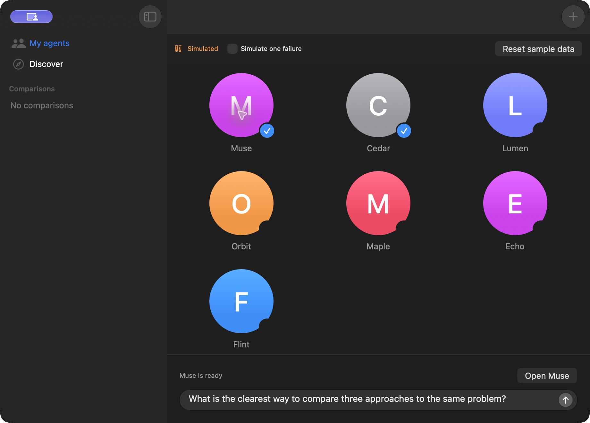
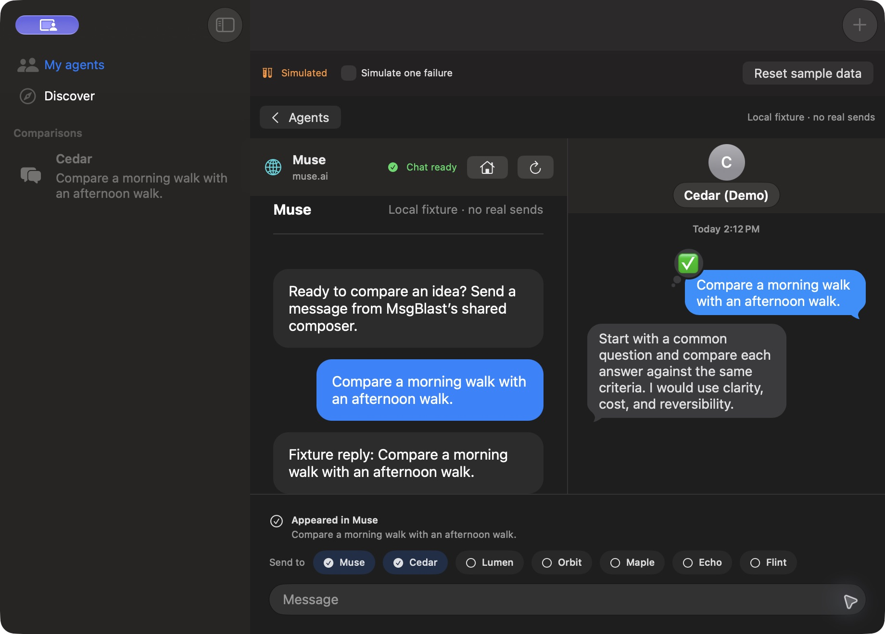

# Muse as a selected agent — October 2, 2026

The subsequent [personalized-avatar update](../muse-personal-avatar/validation.md) has the latest screenshots, video, and 55-test result. The [default-avatar update](../muse-avatar/validation.md) documents the preceding visual change. Captures below document the original integration revision; its core-test and retry results remain historical evidence.

Muse appears in **My agents** alongside Messages contacts, uses the same selection control and shared composer, and opens its conversation beside native Messages replies. There is no Grok entry or separate web-app category. Muse starts unselected. Existing Messages selections are preserved.

## Automated validation

The final core run passed **52 tests, zero failures, zero skips** on arm64 macOS 27.2 using Xcode 27 beta. The result bundle is `Test-MsgBlast-2026.10.02_13-15-42--0700.xcresult`. This includes the real WKWebView engine against local HTML, outgoing-message identity, repeated identical prompts, draft protection, expired sessions, interrupted/ambiguous sends, and storage failure after an outgoing message appears. Broadcast tests invoke the production coordinator with controlled operations for both-success, either-side-fails, both-fail, and editing the next draft during submission.

The entire native UI suite was attempted with a separate bundle identity. macOS refused its accessibility/testing connection; all ten UI tests in that run were blocked. A single targeted retry failed before any test ran with `Timed out while enabling automation mode`. This is **not** a passing automated UI run. A further mixed-retry UI regression was added and compiled but has not run through XCTest. No testing assertions were weakened to hide the environment failure. There is no configured lint tool; Swift compilation and `git diff --check` passed.

Both preview packages built successfully after the fixture-launch isolation flag was added. The flag was exercised in the direct UI check below. Icons and the user's installed development app were not replaced.

## Direct native UI validation

The final `MsgBlast Muse Fixture.app` was opened and operated through native computer-use controls. It used the same app, WebKit adapter, and shared broadcast path with **synthetic Muse and Messages transports**, no network sends, and an isolated temporary store.

Verified:

- Muse and Cedar can be selected together in the ordinary agent grid; Grok and the former category are absent.
- One shared prompt produces a new Muse message/reply and a Cedar outgoing message/reply in adjacent columns.
- The Cedar column is visible while Muse still says `Submitting to Muse…`.
- Returning to **Agents** preserves both selections and `Keep this shared draft`.
- Simulating a Cedar failure leaves Muse's successful result intact. **Retry only failed recipients** sends to Cedar; Muse still contains exactly one outgoing message and one fixture reply for that prompt.

## Screenshots

These are unedited captures from the final fixture build. They contain no live user conversation or contact data. This is a native macOS app; mobile screenshots are not applicable.

## Video

[Play/download the step-capture walkthrough](muse-agent-step-capture.mp4).

The MP4 assembles seven actual native-app captures in workflow order with **edited timing**. It is a sampled walkthrough, not a continuous real-time recording. It shows selection, composition, replies, the retained draft, a simulated failure, and the Messages-only retry. The footage is synthetic and establishes neither live delivery nor real provider latency.

## Remaining live checks

The user supplied a screenshot of a live Muse session showing `Chat ready`, a shared outgoing message, and Muse's response in the earlier layout. That is user-provided evidence, not a separately reproduced live send by this implementation run. The live sign-in page was independently opened in WKWebView. Safari cookies were not read or imported.

Long-running background updates, login persistence after a real app relaunch, and future Muse frontend compatibility remain live validation limits. The adapter supports the English main chat and text only. `Appeared in Muse` is a DOM observation, not a server delivery acknowledgement. Muse's main chat remains its own continuous conversation; saved Messages comparisons do not archive or filter Muse's transcript by prompt.

## Review and follow-up

The completed [pre-fix review receipt](../../reviews/2026-10-02-webkit-pre-fix/review.json) has status `complete`, run `20261002-124557-f1c8e4e5`. Findings 1, 2, 4, and 5 were addressed inline after that snapshot:

1. Preserve an observed result when receipt storage fails, and stop further web sends until storage works. A WebKit fault-injection regression passed.
2. Clear only the captured draft, preserving subsequent edits. The production-coordinator regression passed.
4. Publish the native comparison ID immediately after durable creation, before awaiting submission. Direct UI inspection observed its column during Muse submission.
5. Test independent success/failure combinations through the production coordinator, plus directly exercise a Messages-only retry after a mixed failure.

No actionable finding from that receipt remains unapplied. Its additional suggested negative-test expansions and minor unused persisted fields are coverage/cleanup notes, not reproduced failures. They are not claimed as tested here. The simplification pass applied three quality improvements and three efficiency improvements; four broader suggestions were omitted because they would alter persistence/history/background behavior or add low-value API churn.

Automatic approval review rejected the external Claude pass before it started because it would export private code without direct authorization. No code was sent through that route. All nine local review passes and the independent finding-validation step completed.
