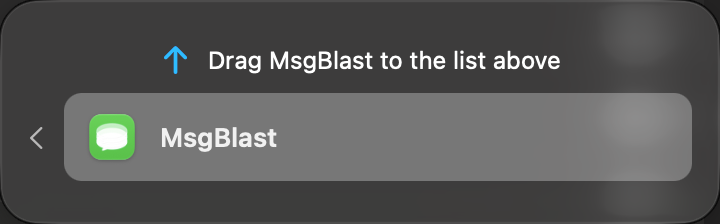

# Native permission handoff validation

Implemented the user-approved AskForPermission-style history handoff: source-card flight, dashed placeholder, adjacent Liquid Glass panel, real running-app bundle drag, Back flight, Settings movement tracking, Reduced Motion bypass, and completion after the actual history open/query. No private TCC APIs or automatic permission grants are used. The adapted interaction's MIT notice is included in the app resources.

## Verified

- Full application suite: **41 passed, 0 failed, 0 skipped**, including all seven native UI workflows. Result: `build/Logs/Test/Test-MsgBlast-2026.10.01_19-56-45--0700.xcresult`. Three internal QoS runtime warnings were reported; there were no test failures.
- After the final Settings-close completion fix: **36 passed, 0 failed, 0 skipped, 0 runtime warnings** (35 core/AppKit/controller tests plus the native guide interaction). Result: `build/Logs/Test/Test-MsgBlast-2026.10.01_20-00-23--0700.xcresult`.
- Native interaction opens Full Disk Access, discovers the floating guide as a dialog, checks its enabled app drag card, performs a cancelled drag, and uses Back to restore the original row without claiming access.
- Core/AppKit tests verify actual file-URL pasteboard round trips, reject non-app/remote/missing paths, clamp geometry across display coordinates, and prove a drop alone cannot mark access available.
- Controller tests verify completion survives a required restart, repeated successful checks do not republish unchanged state, closing Settings retains pending completion, and explicit Back abandons it.
- `git diff --check` passes.

The screenshot below is captured from the actual final native guide. History denial was explicitly simulated in an isolated demo fixture; the test did not grant/revoke Full Disk Access or send real messages. It is not ImageGen output.

## Live access boundary

The regular app opened the correct Full Disk Access pane. The apparent exit during the earlier handoff was a normal Quit AppleEvent in the macOS log, not a demonstrated crash; history loaded after that relaunch.

The final build's Full Disk Access switch was observed off after the final rebuild. `codesign -d -r-` reports a designated requirement bound to binary hashes, and `security find-identity -v -p codesigning` reports zero valid identities. Each ad-hoc development rebuild changes that identity and can invalidate the previous approval. A stable signed distribution is needed before claiming a frictionless update experience. No identity or permission was changed automatically.

The user replied “enabled” after enabling the final build manually. The regular app was then inspected: its previously disabled recipient controls resolve to actual live handles, its composer/attachment control is enabled, and the history-unavailable row is absent. In AppModel, these controls become available only after the actual read-only database open/chats query succeeds. Final live history access is verified; no further build or signature change followed the approval.

By the first main-window inspection after approval, the handoff row had already been dismissed and its pending marker was absent. This does not prove the live Done state was seen; that completion transition is covered by controller tests. Actual new-app registration by dropping into Settings was not performed automatically or inferred from the cancelled-drag fixture.

## Review and scope

Code review: skipped (ce-code-review unavailable). The actual top-level review terminated with `status: failed` because the host's agent thread limit prevented its first required reviewer from starting; receipt location `/tmp/20261001-194827-nj35hh1l`. No independent reviewer or validator result is claimed.

An explicit manual diff review covered the handoff state, cancellation generations, panel/window-menu cleanup, restart marker, source timing, native accessibility, drag payload, Settings tracking, fixture isolation, integration, license resource, and tests. It found and fixed the reverse-flight completion race, no-op polling publications, premature source placeholder, inaccessible drag-card state, and lost completion after Settings closes.

Simplification: the reuse reviewer found no actionable reuse changes. Quality and efficiency were reviewed inline after reviewer capacity failed; lifecycle cleanup was consolidated, and redundant publications were removed. This is bounded fallback coverage, not a completed independent code-review receipt.

Changes remain local alongside existing app WIP. No PR was created. The broader original app goal and its older-comparison inline-reply validation gate are not claimed complete by this onboarding work.

## Dock follow-up

When the user reported no Dock icon, the actual running-app/process lookup initially found no MsgBlast process. MsgBlast was reopened from its existing final build, without rebuilding or changing its signature. The live process was then verified running with `NSRunningApplication.activationPolicy == .regular` (raw value 0); it is not configured as a hidden accessory app. The built bundle includes `CFBundleIconFile=AppIcon`, `CFBundleIconName=AppIcon`, `AppIcon.icns`, and `Assets.car`. `msgblast-app-icon.png` is an extraction of the actual built icon, not a mockup. Dock visual inspection through the native tool timed out, so no screenshot proving Dock placement is claimed.
